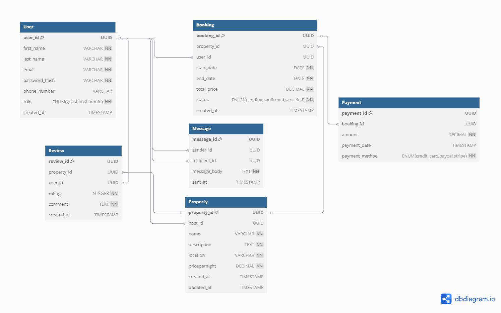

# Database Normalization Analysis

## Introduction

This document explains the normalization process applied to the Airbnb database design, ensuring it adheres to Third Normal Form (3NF). Normalization reduces data redundancy, improves data integrity, and optimizes database performance.

## Initial Schema Analysis

The initial database schema includes the following entities:
- User
- Property
- Booking
- Payment
- Review
- Message

Let's analyze each entity against normalization rules:

## First Normal Form (1NF)
- **Definition**: Each table has a primary key, and each column contains atomic values (no repeating groups or arrays).
- **Analysis**: All tables have UUID primary keys, and all attributes contain atomic values. There are no multi-valued attributes or repeating groups.
- **Status**: The schema satisfies 1NF.

## Second Normal Form (2NF)
- **Definition**: The table is in 1NF, and all non-key attributes are fully functionally dependent on the primary key.
- **Analysis**: 
  - All tables use a single-column primary key (UUID).
  - All attributes in each table depend on their respective primary key.
  - No partial dependencies exist since we're using single-column primary keys.
- **Status**: The schema satisfies 2NF.

## Third Normal Form (3NF)
- **Definition**: The table is in 2NF, and no non-key attribute depends on another non-key attribute (no transitive dependencies).
- **Analysis**:
  - **User**: All attributes depend directly on user_id.
  - **Property**: All attributes depend directly on property_id.
  - **Booking**: All attributes depend directly on booking_id.
  - **Payment**: All attributes depend directly on payment_id.
  - **Review**: All attributes depend directly on review_id.
  - **Message**: All attributes depend directly on message_id.

*Figure 1: Normalized database schema diagram showing entity relationships*

## Conclusion

The current database schema satisfies Third Normal Form (3NF) requirements. All tables have appropriate primary keys, there are no partial dependencies, and no transitive dependencies exist.