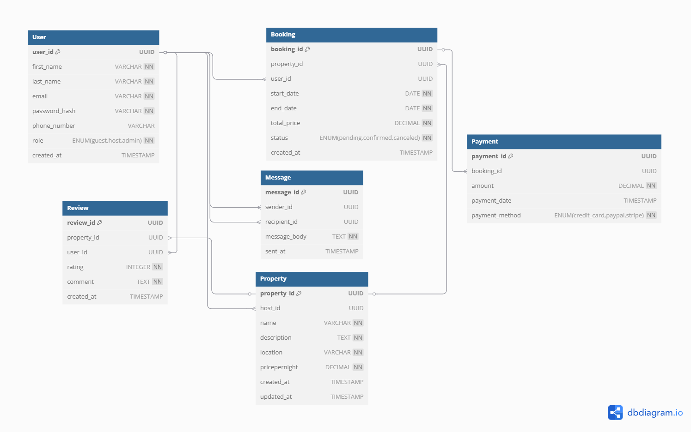

## Third Normal Form (3NF)
- **Definition**: A table is in 3NF if it is in 2NF and all non-key attributes are non-transitively dependent on the primary key.
- **Analysis**:
    - **User**: All attributes depend directly on `user_id` with no transitive dependencies.
    - **Property**: All attributes depend directly on `property_id` without depending on other non-key attributes.
    - **Booking**: All attributes depend directly on `booking_id` with no transitive dependencies.
    - **Payment**: All attributes depend directly on `payment_id` with no transitive dependencies.
    - **Review**: All attributes depend directly on `review_id` with no transitive dependencies.
    - **Message**: All attributes depend directly on `message_id` with no transitive dependencies.

The database schema therefore satisfies Third Normal Form requirements, as demonstrated in the diagram:

